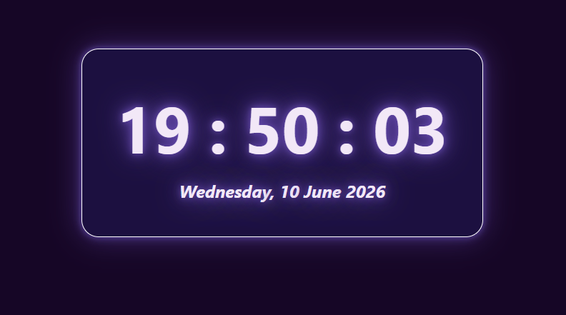

# Digital Clock ⏰✨

A sleek digital clock built with React, featuring live time updates, date display, and a modern neon-inspired UI.

---

## 🔗 Live Demo

Check out the live version here:

👉 [Digital Clock](https://erleen0307.github.io/digital-clock-react/)

---

## 📌 Features

* Live clock updates every second
* Displays current day, date, month, and year
* Responsive and modern UI design
* Neon glow effects and hover animations
* Proper cleanup of intervals using React Hooks 

---

## 🛠️ Technologies Used

* React
* JavaScript (ES6+)
* CSS3
* Vite

---

## ⚛️ React Concepts Practiced

* useState
* useEffect
* Component Re-rendering
* setInterval
* Cleanup Functions
* Date Object Manipulation

---

## 🚀 How to Run Locally

### 1. Clone the Repository

```bash
git clone https://github.com/erleen0307/react-digital-clock.git
cd react-digital-clock
```

### 2. Install Dependencies

```bash
npm install
```

### 3. Start Development Server

```bash
npm run dev
```

Open the local URL provided by Vite in your browser.

---

## 📁 Project Structure

```text
react-digital-clock/
├── public/
├── src/
│   ├── App.jsx
│   ├── App.css
│   └── main.jsx
├── index.html
├── package.json
├── vite.config.js
├── screenshot.png
└── README.md
```

---

## 📸 Screenshot

### ⏰ Live Digital Clock



---

## 🎯 Learning Outcomes

This project was built to practice React Hooks and understand:

* State management using useState
* Side effects using useEffect
* Mounting and unmounting concepts
* Cleanup functions with clearInterval
* Real-time UI updates through state changes

---

## 🙋‍♀️ Author

### 📅 Date Completed: June 10, 2026

Made with ❤️ by [@erleen0307](https://github.com/erleen0307)
